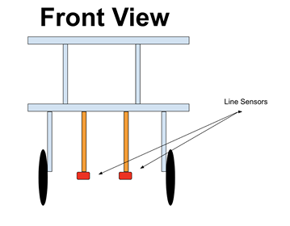
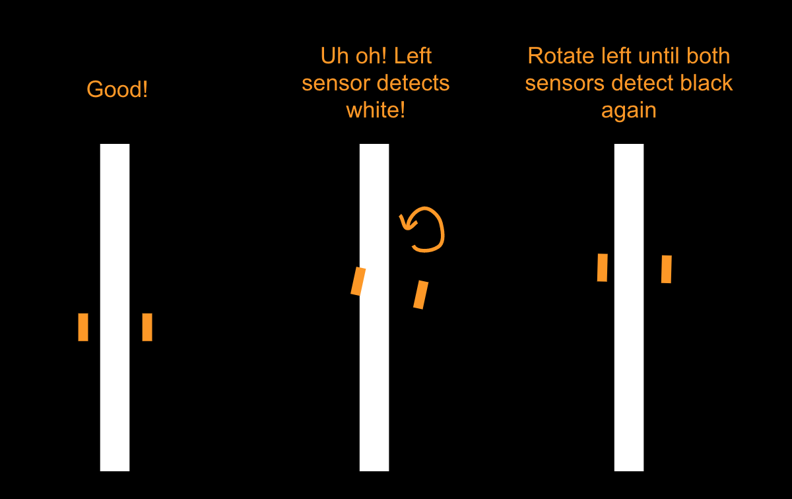

Milestone 1 
===========

The goal of this milestone was to implement line sensors (SparkFun Line Sensor
Breakout - qre1113) so the robot could follow and traverse lines in a grid. 

The robot used two line sensors to complete the tasks below.

The sensors were placed side by side (approximately one inch apart), symmetrical
to the center frame of the robot. When centered, the white line would lie
between the sensors.

## Following a Line

With the sensors straddling the white line, both sensors should detect black
when following the line correctly. We implemented logic so if one sensor
detected white, which the robot would immediately turn in the opposite direction
until that sensor did not detect white anymore. This is represented in the image
below, where the line sensors are the orange rectangles.

Here is pseudo code for this idea. Note that because the line sensors return a
large range of values when analog read, we had to set a threshold for dark and
light values. Any analog reading <1000 was considered to be white; a reading
>1000 was considered to be black. 

    while (1)
      while left sensor on line and right sensor not on line
        Rotate left
      while  right sensor on line and left sensor not on line
        Rotate right
      continue forward

<iframe width="560" height="315" src="https://www.youtube.com/embed/YzMPTGq_EcQ" frameborder="0" allow="autoplay; encrypted-media" allowfullscreen></iframe>

## Turning

In order to turn, we needed our robot to detect when it was crossing an
intersection. To do this we detected when both of our line sensors detected a
white line below them. Once the robot gets fully past the intersection it begins
turning, by keeping one wheel going forwards and the other going backwards. Then
it uses the line sensors again to determine when it has turned fully on to the
other line. Each sensor (both left and right) must cross onto and then off of a
line in order for a full 90º rotation to be complete.

    /* turn left */
    void turn_l() {
      bool fr_hit_line = false, 
           fr_off_line = false,
           fl_hit_line = false,
           fl_off_line = false;
      /* start rotating */
      rotate_l();
      /* stop rotating when both sensors have crossed a line */
      while (!(fr_off_line && fl_off_line)) {
        if (fr_on_line() & !fr_hit_line)
          fr_hit_line = true;
        if (fl_on_line() & !fl_hit_line)
          fl_hit_line = true;
        if (!fr_on_line() & fr_hit_line)
          fr_off_line = true;
        if (!fl_on_line() & fl_hit_line)
          fl_off_line = true;
      }
    }

## Figure 8

To implement the figure 8, we kept an intersection count. If the robot had just
reached its first, sixth, seventh, or eighth intersection, it would turn left.
If the robot had just reached its second, third, fourth, or fifth intersection,
it would turn right. After completing a figure 8, the intersection count would
reset. This allowed the robot to complete the figure 8 continuously.

